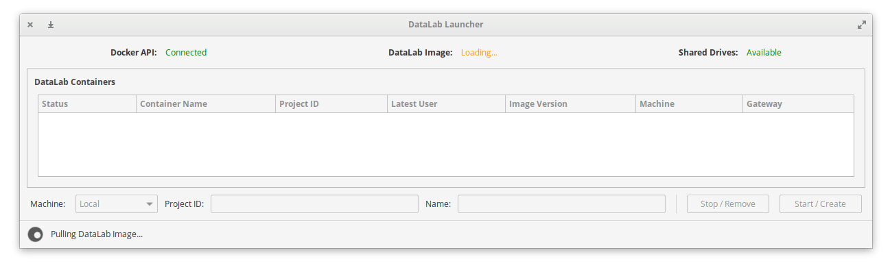
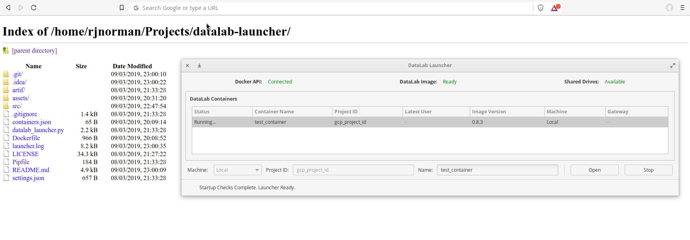

# Datalab Launcher

A GUI tool to build, launch, and manage local [Google Datalab](https://cloud.google.com/datalab/) instances in a team environment.

**NOTE**: This is an old (~3 years) tool that was built when DataLab was in beta and the [native CLI](https://cloud.google.com/datalab/docs/reference/command-line/commands) interface did not exist. 
This tool is now redundant and it's use-case is much better catered for by the CLI interface.
Moreover, the code is incomplete, questionable, and was never stressed in a production environment.



### Cross-platform Compatability

Originally, this tool was cross-platform for Windows/Linux. In order to run on Windows,
 the tool was bundled with a full compatible Python distribution, the PyGTK library, and a .exe 
launcher that pointed to the entry-point script. For obvious reasons, this has been removed
from this upload, and the functionality scrapped.

### System Dependencies

The tool uses the `docker-py` Python package to interface with a pre-existing Docker installation
on the host system. Additionally, some GTK libraries need to be installed. 

These dependencies can be setup by doing the following:

```bash
sudo apt-get install libcairo2-dev libjpeg-dev libgif-dev
sudo apt-get install gobject-introspection libgirepository1.0-dev
sudo apt-get install docker.io
sudo groupadd docker
sudo usermod -aG docker $USER
# We must reboot the system for user-group changes to take effect
sudo reboot
```

**NOTE:** The steps above worked for me from a fresh(ish) Ubuntu 18.04 installation. YMMV.

There are also Python dependencies required by the tool. The `Pipfile` provides
a virtual environment in which these requirements are met. See the [pipenv](https://pipenv.readthedocs.io/en/latest/) documentation on how to use 
this file.

### Usage

To run the launcher, the entry-point script should be called from the project's root directory,
using the python virtual environment.

```bash
    python datalab_launcher.py
```

The GUI window should then open, as shown in the screenshot above. 

Debugging (verbose) console output can be enable with the `-d` CLI argument.

### Under the hood

On first load, the launcher will pull the DataLab docker image, using the local Dockerfile.
This Dockerfile allows the base DataLab image to be extensible (e.g. installing [R](https://www.r-project.org/about.html) statistical packages).

On every load of the tool, the `shared_drive` will be checked for a Dockerfile differing to the 'local' one.
If there is a differing file, the launcher informs the user that there is an 'Update Available'.
Updating will replace the 'local' Dockerfile with the contents of the 'shared' one, which mean new DataLab instances will use this newer image (existing instances will remain unchanged).

As the `shared_drive` is intended to be a shared NFS-mounted drive, this means updates can 
be rolled out to all users of the tool from a central location. This drive has multiple uses, most important of which
is it allows a central storage-point for DataLab notebooks that can be mounted to the locally-hosted DataLab instances seamlessly.

Once the image has been built, two types of DataLab instances can be built; `local` and `cloud`.
In a `local` instance, both the UI and Python kernel are running locally. In a `cloud` instance, a gateway is
used between the UI on the local instance, and a remote Python kernel running on an GCP VM. 
These were two options presented by Google in the beta days for running DataLab. At time of writing,
I'm unsure if a 'gateway' instance is worthwhile or even feasible.

Creating an instance requires specifying a unique `name` for the instance, and the `GCP Project ID` 
that will be used by DataLab (e.g. for billing purposes).

Once an instance has been created, it can then started and opened.
Opening an instance starts a countdown, after which a browser window will be opened 
pointing to the Web UI for the newly-started instance. 



The countdown gives the container time to boot, and the UI time to start and become available.
It should be tweaked to an appropriate value based on the time it takes to load on the system it's running on.

### Settings

The `settings.json` file contains some configuration options for the launcher.

|Setting|Default Value|Purpose|
|------|-------------|-------|
|latest_dockerfile|*./artif/shared_drive/*|The path to the directory containing the 'latest' dockerfile. When in a team environment, this would likely be on a shared network (NFS) drive.|
|settings|*{'open_on_start': true}*|If 'open_on_start' is set to `False`, then this disables the countdown before loading the Web UI|
|local_drive|*artif/*|The directory that the tool should consider to be the 'local drive' where it will store 
|drives|*{{ See file for examples }}*|Defines a list of directories from the `shared_drive` that should be mounted in the DataLab instance, alongside mounting options (i.e.read/write permissions, it's local mountpoint, and human-readable name|
|docker_client_timeout|*1200*|The timeout for the 'docker-py' client|
|opening_countdown|*3*|The time (in seconds) to countdown before opening a browser window, when opening an instance|
|containers_logfile|*./containers.json*|The path to the file that persists metadata about the created instances.|

